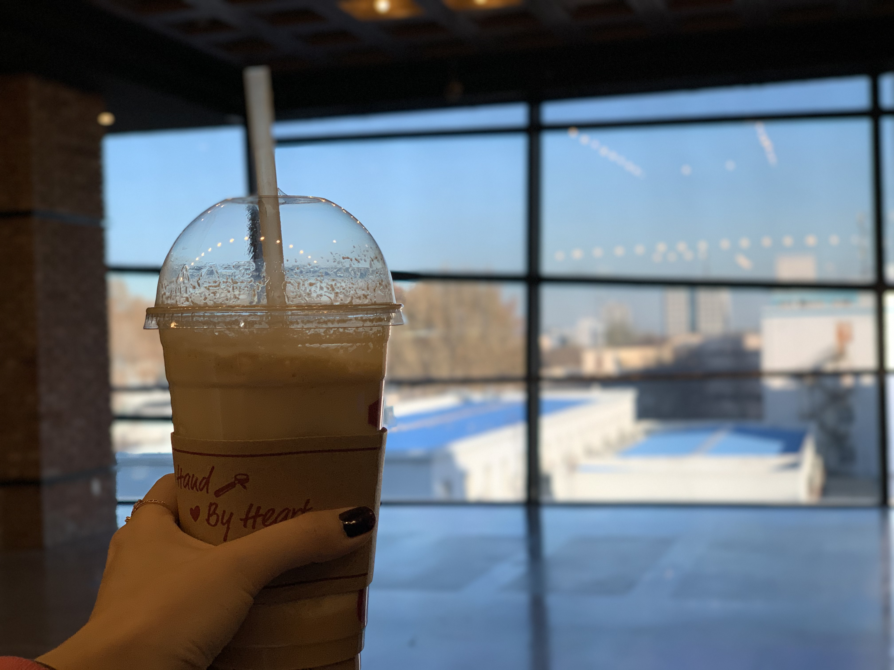

<!-- This Globe thing doesn't work, because I need a plugin gatsby-remark-images -->

###### This is my first blog post, I worte along with Json!

## This is me holding a big cup of coffee waithing outside the theatre, I bet you aleady see that I'm a coffee lover and into movie.

May your life be filled with happiness and success. I could never love anyone as I love my sisters and brothers.
This proves that the new idea is not only part of the your daily thoughts, but also a light bulb that can be on power someday as you believe. The timer keep clocking aside you and me. May youth is always be there for us.
It seems flexible enough to stand for our own. Life doesn’t stand still, neither should your vision. I can’t do every morning, but I'll catch up at night.

---

I know it doesn’t look like make a lot of sense right now. Bear with me not being a good writer yet.
