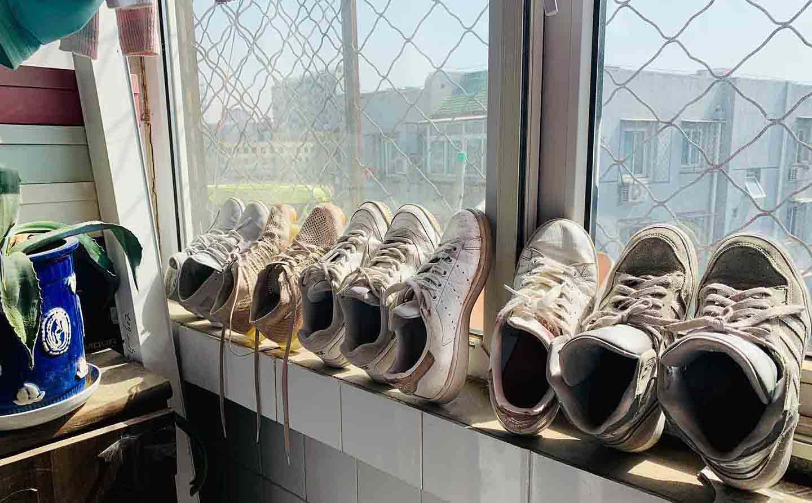

###### Go get a better job!

## First Step 👉 Interview

Few months ago, I decided to change my job, simply get a better job. I updated my VC, said hello to some managers and hr.
Chances out there are pretty a lot. But couple days later, the harsh reality hits me, again, and it's harder.
So far, it's not good. The million dollar question is how to get my resume proved.

###### I'll keep track of what happens next few days.
##### One, I just had a terrible online interview with a kinda giant internet local company, it's only first step though. I don't think I would pass this one. But I still could learn one or two from it. I really should if I wanna change my job.
##### Two, Got another interview from telephone. Emmm, I did make a few silly anwsers which questions were really critical. I don't have very strong feeling that I could be proved this time. But I hope I could at least have the chance to the next step.

---
