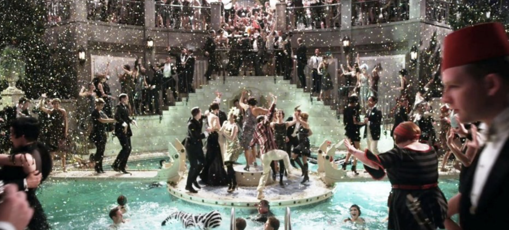

######
Ten cautionary sentences from the great gatsby by F.Scott Fitzgerald.

##### 🧎🏻‍♂️ Whenever you feel like criticizing any one, just remember that all the people in this world haven't had the advantages that you've had.
##### 🧎🏻‍♂️ All things bright and expensive will fade, and never come back.
##### 🧎🏻‍♂️ There are only the pursued, the pursuing, the busy and the tired.
##### 🧎🏻‍♂️ So engrossed was she that she had no consciousness of being observed, and one emotion after another crept into her face like objects into a slowly developing picture.
##### 🧎🏻‍♂️ I couldn't sleep all night; a fog-horn was groaning incessantly on the sound, and I tosssed half-sick between grotesque reality and savage, frigtening dreams.
##### 🧎🏻‍♂️ She vanished into her rich house, into her rich, full life, leaving Gatsby-nothing.
##### 🧎🏻‍♂️ Conduct may be founded on the hard rock or the wet marshes, but after a certain point I don't care what it's founded on.
##### 🧎🏻‍♂️ Tomorrow, we will run faster, stretch out our arms farther. So we beat on, boats against the current, borne back ceaselessly into the past.
##### 🧎🏻‍♂️ Everyone suspects himself of at least one of the cardinal virtues, and this is mine: I am one of the few honest people that I have ever known.
##### 🧎🏻‍♂️ I was within and without, simultaneously enchanted and repelled by the inexhaustible variety of life.