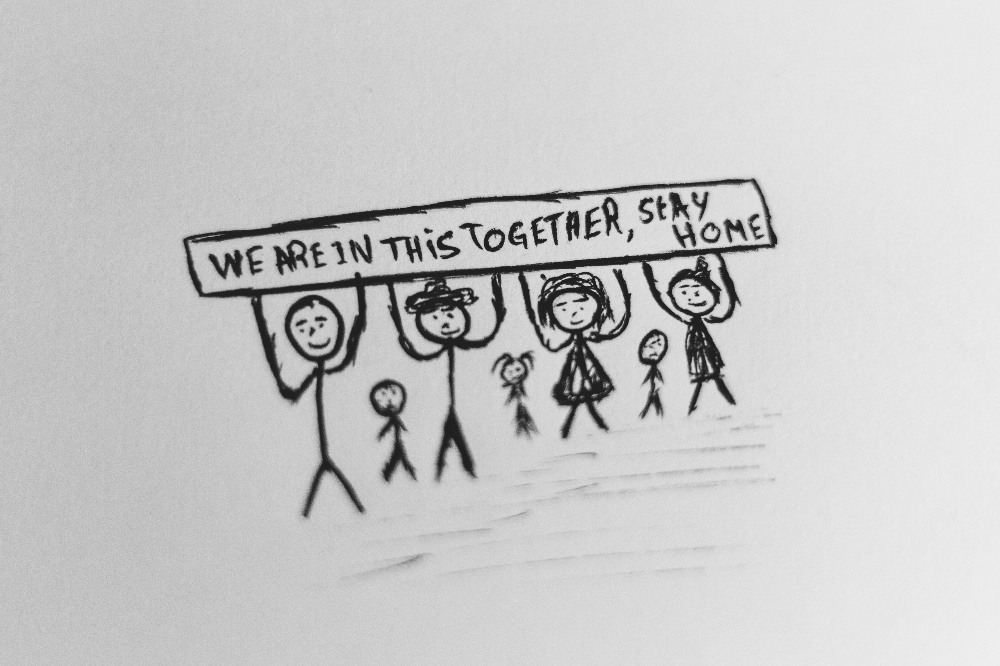

###### Yes, can't believe it's the last day of the year 2020

### This afternoon, I opend my blog project folder and checked what I have committed this year, then I realized I did something this year, I mean, at least this, the world's simplest blog site.
### My very own experiences over 2020 can be wrapped up with a few things.

#### 🦠 Year of the face mask, all kinds of mask... I tried them all
#### 💻 Year of the zoom meeting, third of them were having really bad wifi connection.
#### 🚇 Year of the hard work, although career is still going slowing, but it's on track now.
#### 🏃‍♀️ Year of the taking care of my body, so pround of myself can maintain the habbit and being able to enjoy it at the meantime.
#### 👬 Year of the making new friends, it might sounds weired, but it's still possible to meet new people. Also, make sure they're nice people.

#### Yeah, it is what it is.

### Lastly ahhh, not really a fan to make a list of goals for 2021, because things are changing very fast and it's not just unpredictable. Be safe.